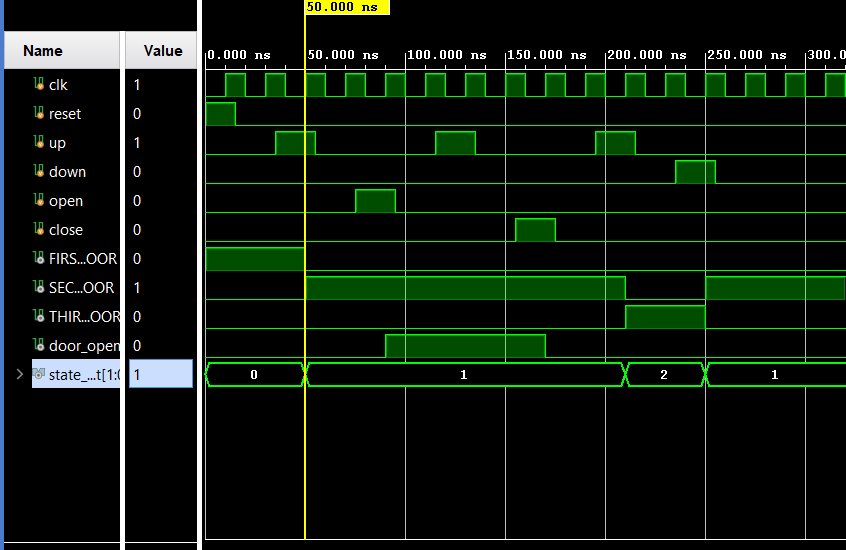

# 3-Floor Elevator Controller

## Overview

This project implements a 3-floor Elevator Controller using Verilog HDL. The design is based on a Finite State Machine (FSM) and supports floor navigation through UP and DOWN commands along with door OPEN and CLOSE functionality.

The controller operates between three floors and prevents floor transitions while the elevator door is open.

---

## Features

- 3-Floor Elevator Control
- FSM-Based Design
- UP and DOWN Floor Navigation
- Door OPEN/CLOSE Control
- Floor Status Outputs
- RTL Simulation and Verification

---

## Inputs

| Signal | Description |
|----------|-------------|
| clk | System Clock |
| reset | Resets elevator to First Floor |
| up | Move elevator up by one floor |
| down | Move elevator down by one floor |
| open | Opens elevator door |
| close | Closes elevator door |

---

## Outputs

| Signal | Description |
|----------|-------------|
| FIRST_FLOOR | Elevator currently at Floor 1 |
| SECOND_FLOOR | Elevator currently at Floor 2 |
| THIRD_FLOOR | Elevator currently at Floor 3 |
| door_open | Indicates door status |
| state_out | Current FSM state |

---

## FSM States

| State | Floor |
|---------|--------|
| 00 | First Floor |
| 01 | Second Floor |
| 10 | Third Floor |

---

## Operation

### Floor Navigation

- First Floor → Second Floor using `up`
- Second Floor → Third Floor using `up`
- Third Floor → Second Floor using `down`
- Second Floor → First Floor using `down`

### Door Control

- `open` sets `door_open = 1`
- `close` sets `door_open = 0`
- Floor transitions are disabled while the door is open

---

## Project Structure

```text
3_Floor_Elevator_Controller
│
├── RTL Design
│   └── elevator_controller.v
│
├── TESTBENCH
│   └── tb_elevator_controller.v
│
├── SIMULATION
│   └── waveform.png
│
└── README.md
```

---

## Simulation Results

The design was verified using a custom Verilog testbench in Vivado Simulator.

The simulation demonstrates:

- Floor transitions
- Door opening and closing
- Floor indication outputs
- FSM state transitions

### Waveform



---

## Concepts Practiced

- Finite State Machines (FSM)
- Sequential Logic Design
- State Transitions
- Control Logic Design
- Verilog HDL
- RTL Simulation and Verification

---

## Future Improvements

- Floor Request Queue
- Multiple Elevator Requests
- Door Timeout Logic
- Emergency Stop Functionality
- 7-Segment Floor Display Interface

## AUTHOR
    Madhu Visagan H T
